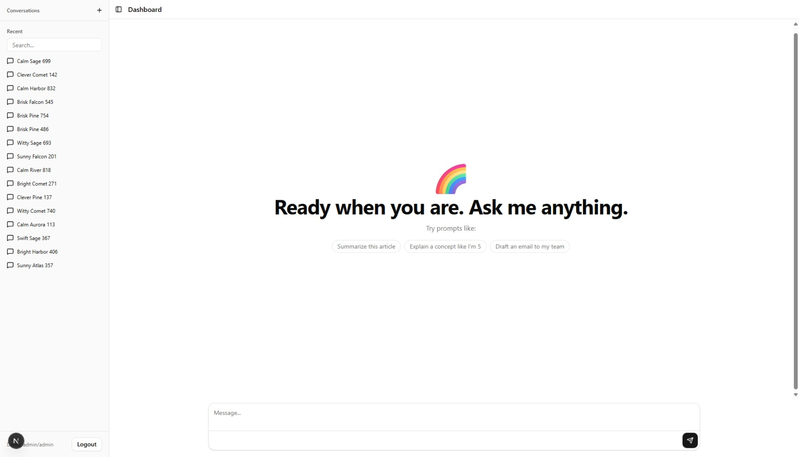

# KorinAI API Integration Example

A demonstration of how to integrate with the KorinAI API, featuring a ChatGPT-like interface built with Next.js and TypeScript. This example showcases a complete implementation including user authentication and a chat dashboard.



## ✨ Features

- **KorinAI API Integration**: Seamless connection to KorinAI's powerful language models
- **Real-time Chat**: Interactive chat interface with message history
- **User Authentication**: Secure login and session management with demo account
- **Local Storage**: Chat history is persisted in the browser's local storage
- **Dashboard**: Clean interface for managing chat conversations
- **Markdown Support**: Messages are rendered with markdown formatting
- **Responsive Design**: Works on all device sizes
- **Dark Mode**: Built-in dark/light theme support

## 🔑 Demo Access

You can access the demo using the following credentials:

- **Login**: admin
- **Password**: admin

> ⚠️ **Note**: This is a demo account. For production use, please create your own account and use proper authentication methods.

## 🚀 Getting Started

### Prerequisites

- Node.js 18.0.0 or later
- npm, yarn, or pnpm

### Installation

1. Clone the repository:
   ```bash
   git clone https://github.com/yourusername/korinai-api-example.git
   cd korinai-api-example
   ```

2. Install dependencies:
   ```bash
   npm install
   # or
   yarn install
   # or
   pnpm install
   ```

3. Run the development server:
   ```bash
   npm run dev
   ```
   Open [http://localhost:3000](http://localhost:3000) in your browser to see the result.

## 🛠️ Tech Stack

- **Framework**: Next.js 14 with App Router (Client-side Rendered)
- **API**: Direct client-side integration with KorinAI API
- **Authentication**: Client-side session management
- **Styling**: Tailwind CSS
- **Language**: TypeScript
- **State Management**: React Hooks with Context API
- **Icons**: Lucide React

> **Note**: This is a pure client-side implementation that communicates directly with the KorinAI API. No server-side proxy is used, which makes it easy to deploy as a static site.

## 💾 Data Persistence

This application uses the browser's `localStorage` to persist chat data, providing these benefits:

- **Offline Access**: Continue conversations even without an internet connection
- **Session Persistence**: Chat history is preserved across page refreshes
- **Performance**: Faster load times by reducing API calls for chat history

### Storage Details
- All chat data is stored locally in the user's browser
- Each user's data is namespaced to prevent conflicts
- Data is automatically synced when the user is online

## 📝 Getting Started with KorinAI

1. Sign up for a KorinAI API key at [KorinAI's website](https://korinai.com)
2. Create a `.env.local` file in the root directory and add your API key:
   ```
   NEXT_PUBLIC_KORINAI_API_KEY=your_api_key_here
   ```
   > **Important**: Since this is a client-side integration, the API key will be exposed in the browser. For production use, consider implementing proper authentication and rate limiting.

3. The application includes a simple authentication system that runs entirely in the browser. All API calls are made directly from the client to KorinAI's servers.

## 🔌 Customization

To customize the chat behavior or integrate additional KorinAI API features, modify the API client in `lib/api/`.

## 📦 Dependencies

- `next`: 14.x
- `react`: ^18.2.0
- `tailwindcss`: ^3.3.0
- `next-auth`: ^4.24.0
   # or
   yarn dev
   # or
   pnpm dev
   ```

5. Open [http://localhost:3000](http://localhost:3000) in your browser to see the application.

## 🛠 Scripts

- `dev`: Start development server
- `build`: Build the application for production
- `start`: Start production server
- `lint`: Run ESLint
- `test`: Run tests

## 📁 Project Structure

```
/
├── app/                    # App router
│   ├── api/               # API routes
│   ├── dashboard/         # Chat dashboard
│   │   └── [chatId]/      # Individual chat sessions
│   ├── login/             # Authentication pages
│   └── page.tsx           # Landing page
├── components/            # Reusable UI components
│   ├── ai-elements/       # AI-specific components
│   └── ui/                # Base UI components
├── lib/
│   ├── api/               # KorinAI API client
│   └── auth/              # Authentication utilities
├── public/                # Static assets
└── styles/                # Global styles
```

## 🌐 Deployment

### Vercel

Deploy your KorinAI integration to Vercel with zero configuration:

[](https://vercel.com/new/clone?repository-url=https%3A%2F%2Fgithub.com%2Fyourusername%2Fkorinai-api-example)

### Environment Variables

For local development, create a `.env.local` file with:

```env
NEXT_PUBLIC_KORINAI_API_KEY=your_api_key_here
```

> **Security Note**: Since this is a client-side integration, the API key will be visible in the browser. For production deployments, consider:
> - Using environment variables at build time
> - Implementing a serverless function for API calls
> - Setting up proper CORS policies
> - Using token-based authentication for users

2. Run the container:
   ```bash
   docker run -p 3000:3000 customer-support-app
   ```

## 🤝 Contributing

Contributions are welcome! Please read our [Contributing Guidelines](CONTRIBUTING.md) for details on our code of conduct and the process for submitting pull requests.

## 📄 License

This project is licensed under the MIT License - see the [LICENSE](LICENSE) file for details.

## 📧 Contact

For any questions or feedback, please open an issue or contact us at support@example.com.
